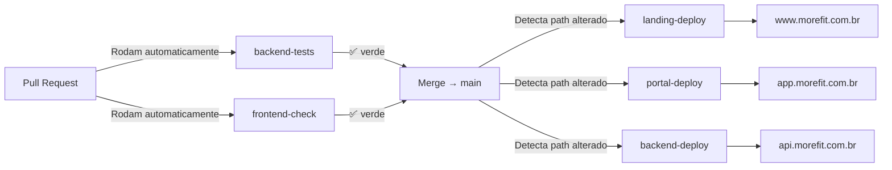

# MoreFit — CI/CD (GitHub Actions)

Este diretório contém os workflows automatizados que rodam a cada push ou pull request no GitHub.

## Workflows disponíveis

| Workflow | Trigger | O que faz |
|---|---|---|
| `backend-tests.yml` | PR ou push em `backend/**` | Sobe MongoDB, instala deps e roda `pytest` (79+ testes) |
| `frontend-check.yml` | PR ou push em `frontend/**` | TypeScript check + Expo lint no app mobile |
| `landing-deploy.yml` | Push em `main` alterando `landing-web/**` | Build Next.js + envia tarball via SCP + `pm2 reload` no VPS Locaweb |
| `portal-deploy.yml` | Push em `main` alterando `portal-web/**` | Build Next.js + envia tarball via SCP + `pm2 reload` no VPS Locaweb |
| `backend-deploy.yml` | Push em `main` alterando `backend/**` | Rsync código para VPS + `pip install` + restart FastAPI |

## Secrets necessários no repositório GitHub

Vá em **Settings → Secrets and variables → Actions → New repository secret** e adicione:

### Deploy (todos os workflows de deploy)
- `LOCAWEB_HOST` — IP ou hostname do VPS (ex: `123.45.67.89` ou `vps123.locaweb.com.br`)
- `LOCAWEB_USER` — usuário SSH (ex: `deploy`)
- `LOCAWEB_SSH_KEY` — chave privada SSH em formato OpenSSH (o conteúdo do arquivo `id_ed25519`, incluindo linhas `-----BEGIN...`)
- `LOCAWEB_PORT` — porta SSH se não for 22 (opcional)

### Só para o portal
- `PORTAL_API_URL` — URL pública do backend (ex: `https://api.morefit.com.br`)

## Ambiente `production`

Crie um **Environment** chamado `production` no GitHub (Settings → Environments) e mova os 4 secrets acima para ele. Isso permite adicionar **required reviewers** (ex: você aprova cada deploy) e proteger contra deploys acidentais.

## Preparação inicial no VPS Locaweb

Rode uma vez, via SSH, para preparar o servidor:

```bash
# 1. Node + PM2
curl -fsSL https://deb.nodesource.com/setup_20.x | sudo -E bash -
sudo apt install -y nodejs
sudo npm i -g pm2 yarn

# 2. Python (backend)
sudo apt install -y python3-pip python3-venv

# 3. Diretórios
sudo mkdir -p /var/www/{morefit-landing,morefit-portal,morefit-backend}/{releases,current}
sudo chown -R $USER:$USER /var/www/morefit-*

# 4. PM2 auto-start
pm2 startup       # copie e cole o comando que ele imprime
pm2 save

# 5. Nginx + SSL
sudo apt install -y nginx certbot python3-certbot-nginx
# Configure /etc/nginx/sites-available/morefit conforme os READMEs de cada projeto
sudo certbot --nginx -d www.morefit.com.br -d morefit.com.br -d app.morefit.com.br -d api.morefit.com.br
```

## Fluxo de release



## Como rodar localmente antes do PR

```bash
# Backend
cd backend && python -m pytest -q

# Frontend mobile
cd frontend && yarn tsc --noEmit

# Landing
cd landing-web && yarn build && yarn typecheck

# Portal
cd portal-web && yarn build && yarn typecheck
```

## Rollback rápido

No VPS, cada projeto guarda as **5 últimas releases** em `/var/www/morefit-*/releases/`. Para reverter:

```bash
ssh deploy@morefit.com.br
cd /var/www/morefit-landing
# Ver releases disponíveis
ls -lt releases/
# Extrair uma release anterior por cima
tar -xzf releases/morefit-landing-<sha-antigo>.tar.gz -C current/
pm2 reload morefit-landing
```
